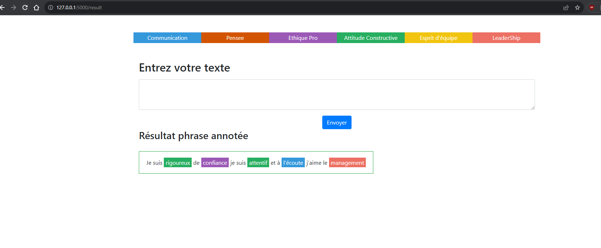
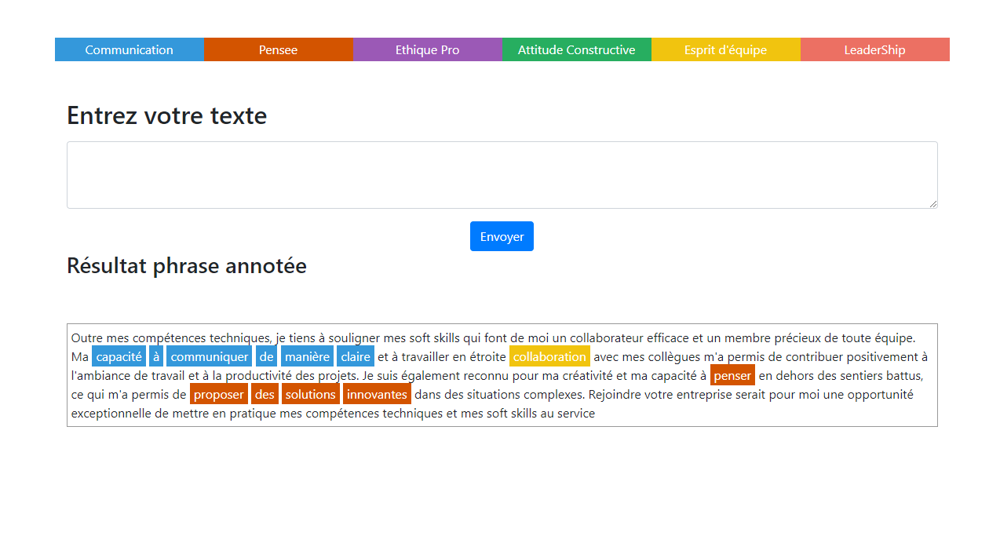

# Introduction 
This part of project claims to create a trained model to detect Soft Skills in French language.

# Getting Started
The model is train in the jupyter notebook file. And you can use th trained model directly.

# Build and Test
The model is already built. If you want to use the model, you have to open it in jupyter or python file with 
```python
# To load model
model = NERModel('camembert', 'model_soft_skills/', use_cuda=False)

# Test 
sentence = ['Je suis rigoureux, de confiance, je suis attentif et à l"écoute, j"aime le management']
prediction = model.predict(sentence)

# Result 
prediction[0]

[[{'Je': 'O'},
  {'suis': 'O'},
  {'rigoureux,': 'B-attitude_constructive'},
  {'de': 'O'},
  {'confiance,': 'B-ethique_pro'},
  {'je': 'O'},
  {'suis': 'O'},
  {'attentif': 'B-communication'},
  {'et': 'I-communication'},
  {'à': 'I-communication'},
  {'l"écoute,': 'I-communication'},
  {'j"aime': 'O'},
  {'le': 'O'},
  {'management': 'B-leadership'}]]
```

If you want to rebuild the model, you can execute all cells in jupyter notebook 


If you want to test directly the model with the web App, go to the folder "/App" and execute 
`flask --app serveur.py --debug run`






# Contribute
Chief of project : Boudjani Nadira
Data Scientist : Jauseau Bapsite 
Annoteurs : Boudjani Nadira, Jauseau Bapstite , Dandieu Jocelyne, Sannier Gilles